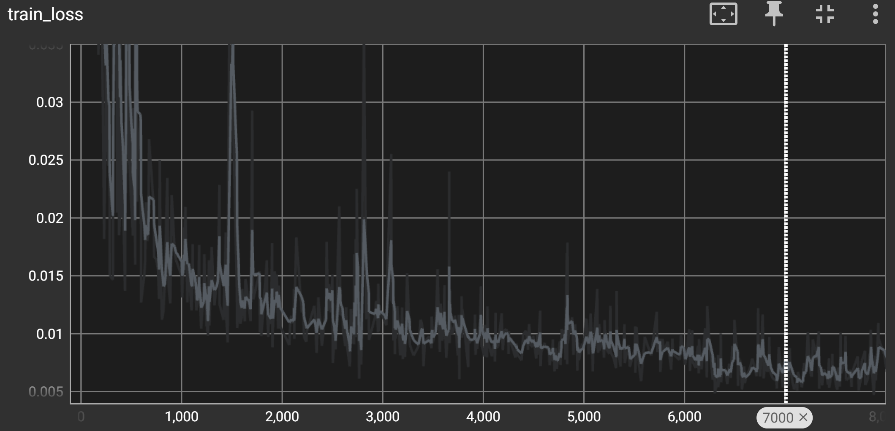
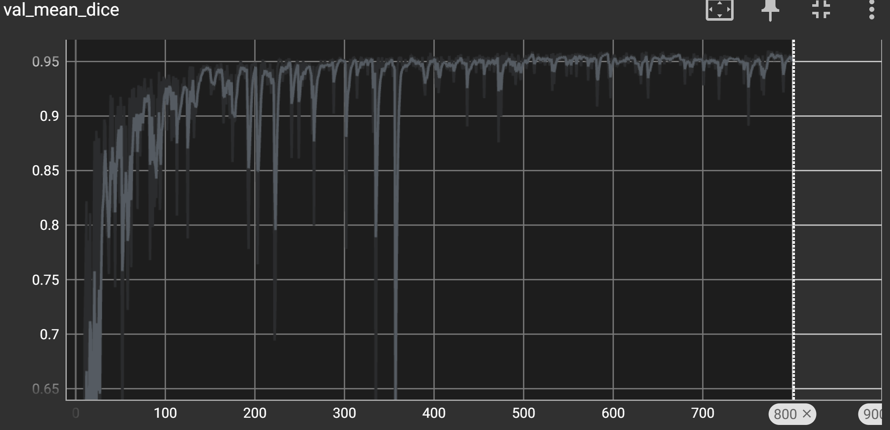
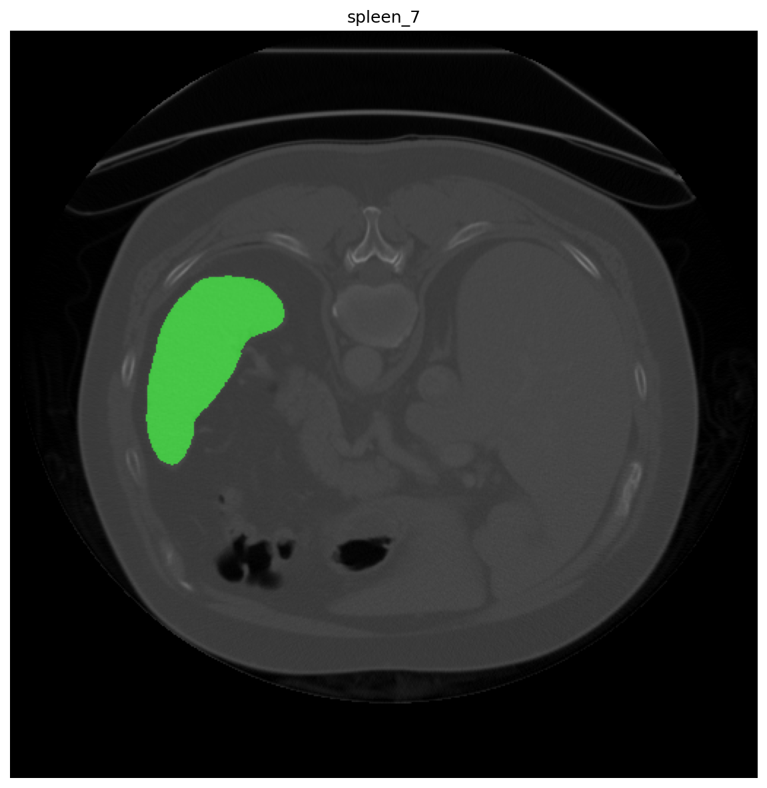
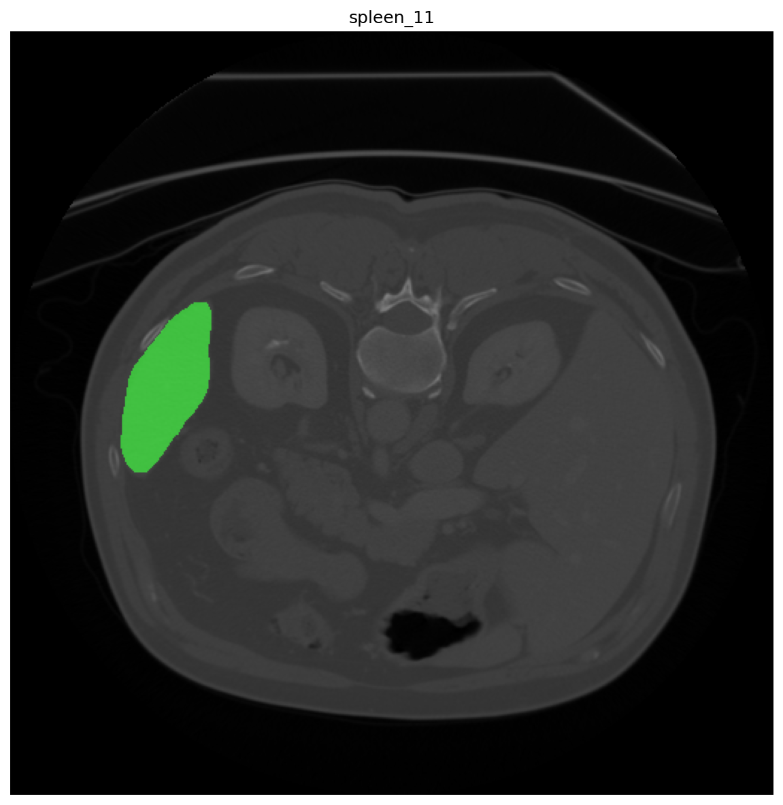
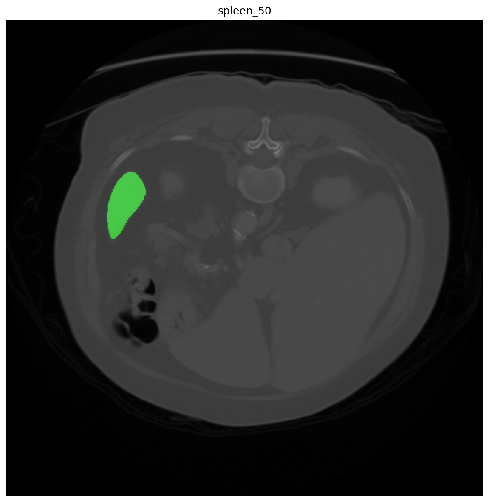
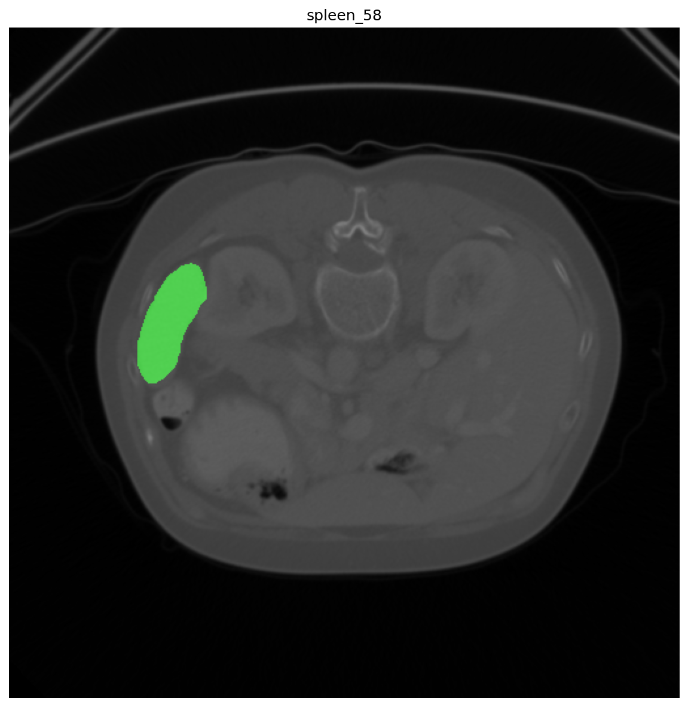

# 沐曦GPU运行MONAI 1.5.2说明文档

本项目由第三方以开源许可证发布，我方未对其源代码作任何修改。您可通过以下链接 https://github.com/Project-MONAI/MONAI/tree/main 查阅本项目的源代码、许可证全文、版权与归属声明及其他声明文件。

## 一、MONAI简介

[MONAI](https://github.com/Project-MONAI/MONAI/tree/main)是一个基于PyTorch的开源医疗影像深度学习框架。旨在联合学术界、工业界及临床研究人员，为医学影像构建先进的端到端训练工作流，并提供标准化、可优化的方式来创建与评估深度学习模型。其功能涵盖医学图像预处理、网络/损失函数/评估指标等特定领域实现，以及多 GPU 多节点数据并行等。

## 二、沐曦GPU环境配置与运行

### 2.1 环境准备

使用沐曦开发者社区提供的[maca-pytorch镜像](https://developer.metax-tech.com/softnova/docker?chip_name=%E6%9B%A6%E4%BA%91C500%E7%B3%BB%E5%88%97&package_name=maca-pytorch:3.8.0.11-torch2.6-py310-ubuntu24.04-amd64)启动容器：

```bash
docker run -it --name test-monai \
  --device=/dev/mxcd \
  --device=/dev/dri \
  --group-add video \
  --shm-size=8G \
  --security-opt seccomp=unconfined \
  --ulimit memlock=-1 \
  --ulimit stack=67108864 \
  -v /remote_home/ai4s-opensource:/workspace \
  cr.metax-tech.com/public-library/maca-pytorch:3.8.0.11-torch2.6-py310-ubuntu24.04-amd64 \
  /bin/bash
```

**参数说明：**
- `--device=/dev/mxcd --device=/dev/dri`：挂载沐曦GPU设备
- `--group-add video`：添加video组以访问GPU
- `--shm-size=8G`：设置共享内存大小
- `-v`：挂载工作目录

> 如需使用更新版本，您可以选择容器镜像（例如 maca-pytorch:xxx-torch2.6-py310-ubuntu24.04-amd64），也可以从裸机非容器环境直接安装。请访问[沐曦开发者|镜像资源中心](https://developer.metax-tech.com/softnova/docker/)获取对应资源。


### 2.2 验证环境

进入容器后，验证PyTorch环境：

```bash
root@db62ca9dfd78:/workspace# python -c "import torch; assert torch.cuda.is_available(); print('PyTorch version:', torch.__version__); print('CUDA OK:', torch.cuda.get_device_name(0))"
```

输出应显示已安装沐曦定制版 PyTorch，MACA 环境可用：
```
PyTorch version: 2.6.0+metax3.8.0.7
CUDA OK: MetaX C500
```
### 2.3 配置maca编译环境
```
export MACA_PATH=/opt/maca
export CUCC_PATH=/opt/maca/tools/cu-bridge
export PATH=$PATH:${CUCC_PATH}/tools:${CUCC_PATH}/bin
export CUCC_CMAKE_ENTRY=2        # 选择使用cu-bridge模拟CMake服务
export CUDA_PATH=${CUCC_PATH}    # CUDA_PATH入口重定向到cu-bridge安装位置
```

### 2.4 安装MONAI 1.5.2
#### 2.4.0 安装系统依赖

```bash
INITIAL_DIR="$(pwd)"
apt update && apt install -y libssl-dev build-essential openssh-server vim gdb git wget curl ca-certificates unzip && apt clean && rm -rf  /var/lib/apt/lists/* /tmp/* /var/tmp/* 
```
#### 2.4.1 下载MONAI
```bash
git clone https://github.com/Project-MONAI/MONAI.git
cd MONAI
git checkout 1.5.2
cd "$INITIAL_DIR"
```

#### 2.4.2 安装依赖
[沐曦资源中心](https://developer.metax-tech.com/softnova/search?package_name=maca-onnxruntime-1.12.0-py310)下载maca-onnxruntime安装包并安装：
```bash
#请从[沐曦资源中心](https://developer.metax-tech.com/softnova/search?package_name=maca-onnxruntime-1.12.0-py310-3.8.0.10-linux-x86_64.tar.xz）下载maca-onnxruntime安装包
tar -xJf maca-onnxruntime-1.12.0-py310-3.8.0.10-linux-x86_64.tar.xz
pip install maca-onnxruntime-3.8.0.10/wheel/onnxruntime_gpu*.whl
```
安装其他 Python 依赖：
```bash
cp MONAI/requirements.txt MONAI/requirements-min.txt MONAI/requirements-dev.txt /tmp/
awk '!/torch/' /tmp/requirements.txt > /tmp/tmp && mv /tmp/tmp /tmp/requirements.txt 
awk '!/torchvision/' /tmp/requirements-dev.txt > /tmp/tmp && awk '!/MetricsReloaded/' /tmp/tmp > /tmp/requirements-dev.txt && awk '!/cucim/' /tmp/requirements-dev.txt > /tmp/tmp  && awk '!/onnxruntime/' /tmp/tmp > /tmp/requirements-dev.txt
python -m pip install --upgrade --no-cache-dir pip 
python -m pip install --no-cache-dir -r /tmp/requirements-dev.txt
git clone https://github.com/Project-MONAI/MetricsReloaded && cd MetricsReloaded && git checkout monai-support && pip install --no-build-isolation .  
cd "$INITIAL_DIR"
```
参考 Issue: [Project-MONAI/MONAI#8536](https://github.com/Project-MONAI/MONAI/issues/8536)
#### 2.4.3 编译安装MONAI
```bash
export TORCH_CUDA_ARCH_LIST=8.0+PTX BUILD_MONAI=1 FORCE_CUDA=1
cd MONAI 
git apply /monai_muxi.patch # 应用少量源码补丁
sed -i 's/torch>=2\.4\.1/torch/' setup.cfg 
BUILD_MONAI=1 FORCE_CUDA=1 python setup.py install && rm -rf build __pycache__
cd "$INITIAL_DIR"
```

验证安装：
```
root@20e6c8a59203:~# python -c "import monai; monai.config.print_config()"
USE_META_DICTMONAI version: 1.5.2+0.gd18565fb.dirty
Numpy version: 1.26.4
Pytorch version: 2.6.0+metax3.8.0.7
MONAI flags: HAS_EXT = True, USE_COMPILED = True, USE_META_DICT = False
MONAI rev id: d18565fb3e4fd8c556707f91ac280a2dc3f681c1
MONAI __file__: /opt/conda/lib/python3.10/site-packages/monai-1.5.2+0.gd18565fb.dirty-py3.10-linux-x86_64.egg/monai/__init__.py

Optional dependencies:
Pytorch Ignite version: 0.4.11
ITK version: 5.4.6
Nibabel version: 5.4.2
scikit-image version: 0.25.2
scipy version: 1.15.3
Pillow version: 11.2.1
Tensorboard version: 2.21.0
gdown version: 6.1.0
TorchVision version: 0.15.1+metax3.8.0.7
tqdm version: 4.67.1
lmdb version: 2.3.0
psutil version: 7.2.2
pandas version: 2.3.3
einops version: 0.8.1
transformers version: 5.12.1
mlflow version: 3.14.0
pynrrd version: 1.1.3
clearml version: 2.1.10

```


## 三、沐曦GPU运行[MONAI Model Zoo](https://github.com/Project-MONAI/model-zoo/tree/dev)
MONAI Model Zoo 以 MONAI Bundle 格式收录了一系列医学影像模型。具体的模型列表参见[https://project-monai.github.io/model-zoo.html](https://project-monai.github.io/model-zoo.html)。沐曦GPU支持运行MONAI Model Zoo。本章节仅展示其中的[spleen_ct_segmentation](https://github.com/Project-MONAI/model-zoo/tree/dev/models/spleen_ct_segmentation)模型在沐曦GPU上的训练和推理过程。
### 3.1 模型简介
[spleen_ct_segmentation](https://github.com/Project-MONAI/model-zoo/tree/dev/models/spleen_ct_segmentation)模型用于 CT 图像脾脏三维分割，训练数据集为[Medical Segmentation Decathlon Challenge 2018](http://medicaldecathlon.com/)。详细介绍及运行命令请参考[spleen_ct_segmentation](https://github.com/Project-MONAI/model-zoo/tree/dev/models/spleen_ct_segmentation)

### 3.2 Loss 曲线
<div align="center">
  
</div>


### 3.3  Dice 指标
<div align="center">
  
</div>

*注：NVIDIA A100 80 GB 训练数据参见 [Project-MONAI/model-zoo](https://github.com/Project-MONAI/model-zoo/tree/dev/models/spleen_ct_segmentation)。*

### 3.4 沐曦 GPU 推理结果
使用沐曦 GPU 训练完成的模型进行脾脏分割推理，部分结果如下图所示（从左至右依次为病例 7、11、50、58 的 CT 图像与预测掩膜叠加）。


<div style="display: grid; grid-template-columns: repeat(4, 1fr); gap: 10px; align-items: center; width: 100%;">
  
  
  
  
</div>


## 四、常见问题与注意事项

### 4.1 运行时报错`Error in allocating private memory because the private memory size required in the kernel is greater than the maximum value set by the system...`  
**问题说明**  
该错误表明应用程序请求的私有内存大小已超过系统当前配置的上限。

**解决方法**    
调整驱动参数`pri_mem_sz`。该操作需使用`root`权限，并会重新加载驱动模块，请务必提前通知当前使用该机器GPU的其他用户，避免影响其正在运行的任务。

```
sudo modprobe -r metax
sudo modprobe metax pri_mem_sz=36
```
说明:`pri_mem_sz`指定每个计算线程可分配的私有内存大小（单位：KB），其值必须在驱动支持的有效范围内设置(0-36)，可根据实际需求调整(过高值可能挤占显存，影响稳定性)。

**验证设置生效**    
```
# 检查驱动是否加载成功
lsmod | grep metax

# 确认参数值已更新（输出应为设定值，如 36）
cat /sys/module/metax/parameters/pri_mem_sz

# 验证GPU状态（应正常输出设备信息）
mx-smi
```

### 4.2 提升 Conv3D 在沐曦 GPU 上的性能  
  设置环境变量：`export PYTORCH_DEFAULT_NDHWC=1`  

### 4.3 精度相关单元测试  
进行精度测试时，需设置：
```
torch.backends.cudnn.allow_tf32 = False
export ENABLE_BLAS_DETERMINISTIC_MODE=1 MCDNN_USE_DETERMINISTIC_ALGO=ON
```
**通常情况下不建议开启上述设置，否则会降低性能。**


## 五、其他
1. 开发者在初次使用曦云GPU运行MONAI时，可遵循本手册进行测试。
2. 沐曦仅维护部分case的正确性，如出现运行问题，可提交issue，亦可以在开发者社区提交bug反馈。
3. 了解更多沐曦开源项目，请参考[沐曦开源社区](https://github.com/metax-maca)

本文档仅提供相关软件的配置与使用说明，不包含亦不分发前述软件的源代码或目标代码，且不涉及对其源代码的任何修改。您按照本文档配置、部署或使用相关软件时，应遵守适用许可证规定的条款及条件。相关软件的源代码、许可证全文、版权与归属声明及其他项目文档，请以其官方网站或原始发布页面为准。

---
Copyright (c) 2026 MetaX Integrated Circuits (Shanghai) Co., Ltd. All rights reserved.
